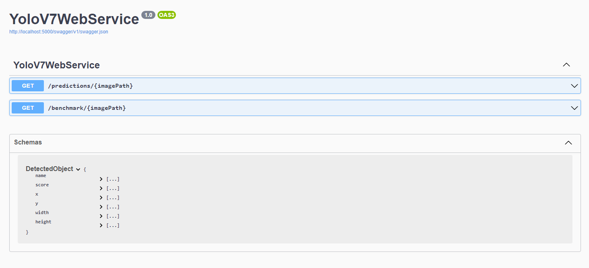

# YoloV7WebService
A YoloV7 Web Service for Person Detection

## Purpose
Older security cameras either don't support AI person detection or use out of date models with lower accuracy. This web service can be used to analyze the snapshots generated during motion events to help determine if they're triggered by people. [Additional objects can also be detected](## "person, bicycle, car, motorcycle, airplane, bus, train, truck, boat, traffic light, fire hydrant, stop sign, parking meter, bench, bird, cat, dog, horse, sheep, cow, elephant, bear, zebra, giraffe, backpack, umbrella, handbag, tie, suitcase, frisbee, skis, snowboard, sports ball, kite, baseball bat, baseball glove, skateboard, surfboard, tennis racket, bottle, wine glass, cup, fork, knife, spoon, bowl, banana, apple, sandwich, orange, broccoli, carrot, hot dog, pizza, donut, cake, chair, couch, potted plant, bed, dining table, toilet, tv, laptop, mouse, remote, keyboard, cell phone, microwave, oven, toaster, sink, refrigerator, book, clock, vase, scissors, teddy bear, hair drier, toothbrush"), however, **only persons will be annotated in the snapshots**.

## Download Pre-Compiled Binaries
https://github.com/Webchantment/YoloV7WebService/releases

## Minimum Requirements (Windows)
ASP.NET Core Runtime 6.x and .NET Runtime 6.x

https://dotnet.microsoft.com/en-us/download/dotnet/6.0

## Build
Use Visual Studio 2022 and compile a Release Build

## How To Test
Run "YoloV7WebService.exe" and visit: http://localhost:5000/swagger

By default the web service runs in CPU mode.

If you want GPU acceleration add the "-gpu" command line option (requires CUDA drivers):
"YoloV7WebService.exe -gpu"

Two endpoints are available:

**/predictions/{imagePath}** - Returns objects detected for a given image in JSON format. If a person is detected, a new annotated image will be created with "-person" appended to the filename. ex) "Image-person.jpg"

**/benchmark/{imagePath}** - Returns the time in milliseconds it takes to load and run object prediction for a given image.

## Example Results

Source: https://ipvm.com/reports/ip-camera-sample-shots
